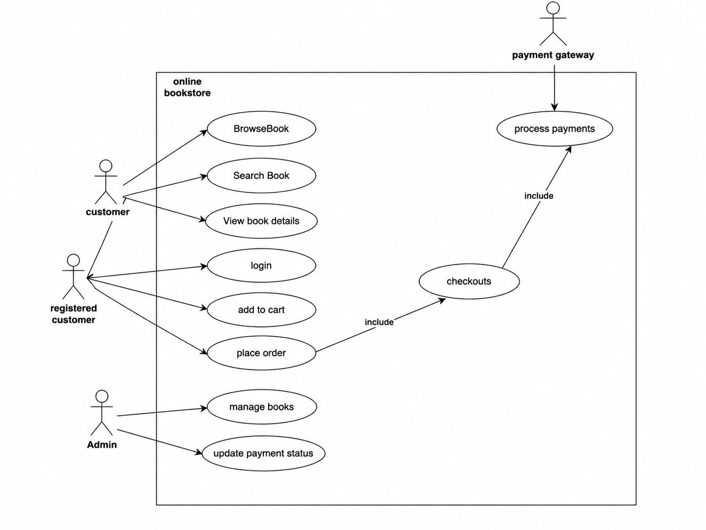
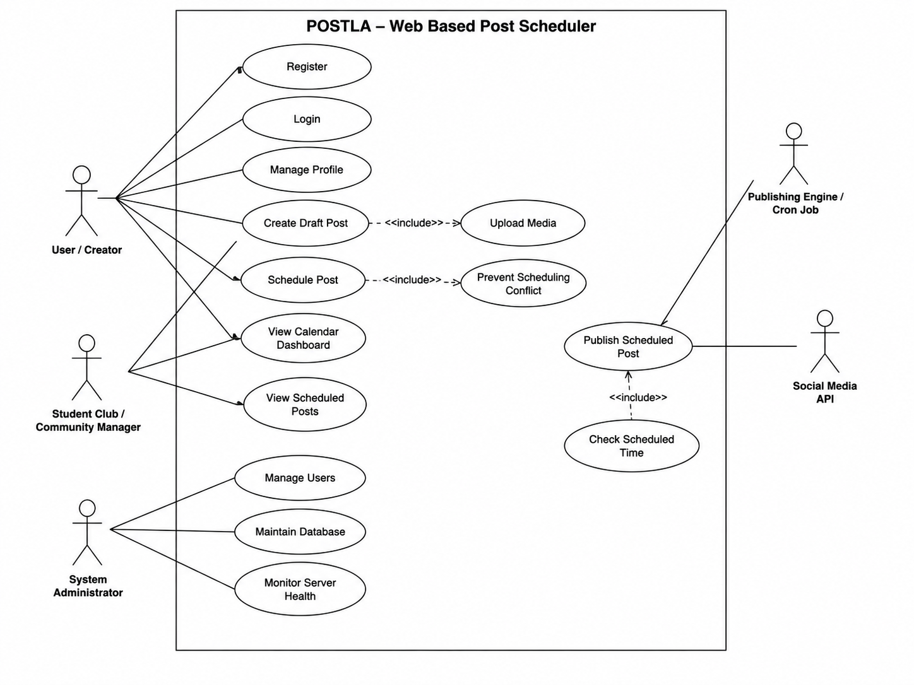
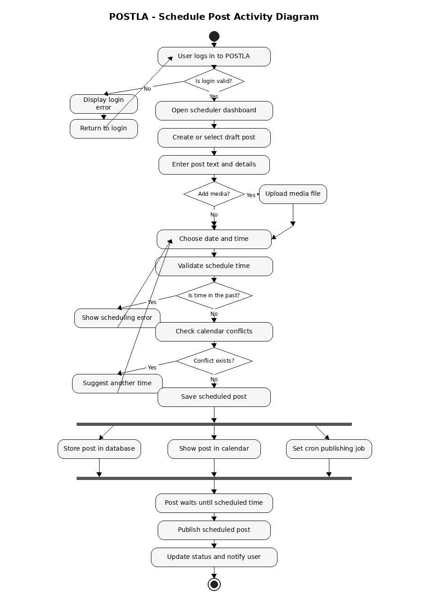
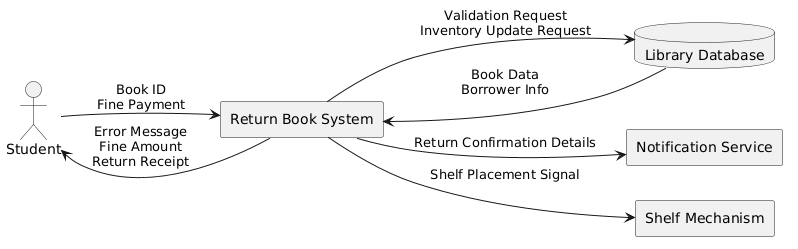
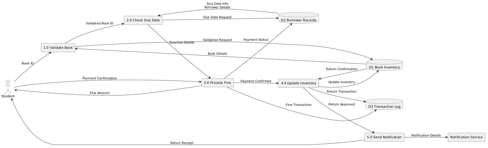
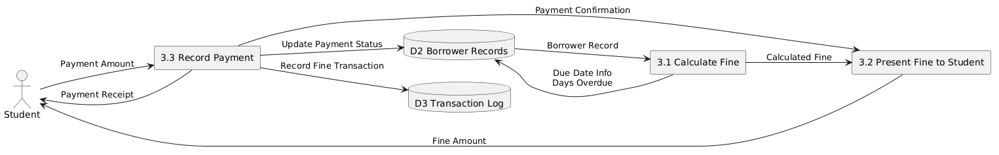
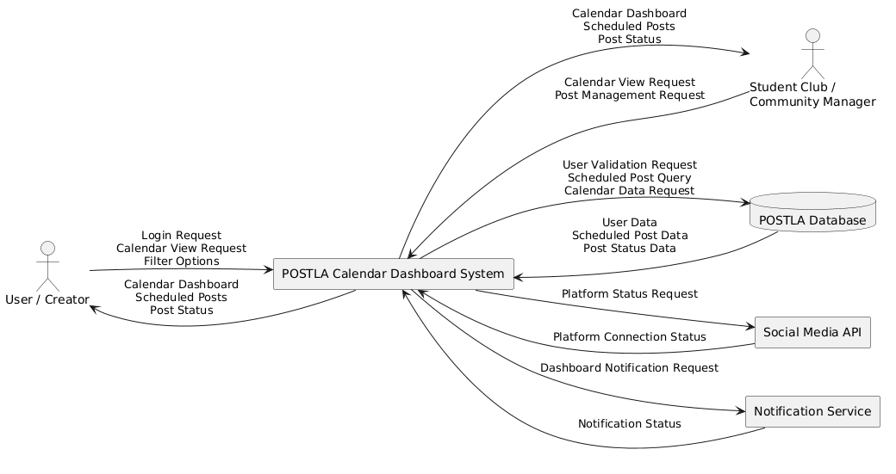
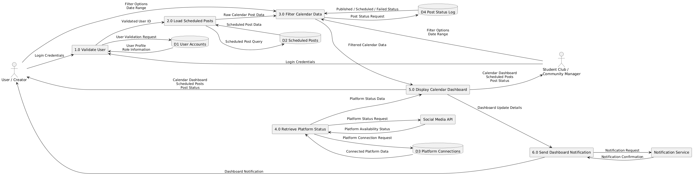
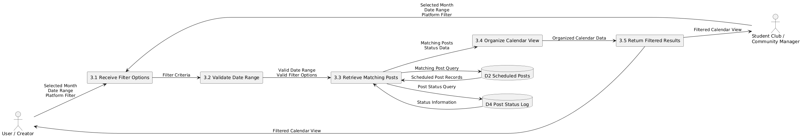

# CMPE314 - Lab 2 Gantt Chart

## Project Title
POSTLA Project

## Team Members
- Deniz Onat Bayer
- Umut Sevinç
- Muhammet Salih Erol
- Melik Koçhan

## Project Description
This project focuses on project planning and scheduling for a software engineering project. The Gantt chart demonstrates task durations, dependencies, milestones, and resource allocation among team members.

## Gantt Chart

## # CMPE314 - Lab 3 Online Bookstore Use Case Diagram

The Online Bookstore use case diagram represents the main interactions between users and the bookstore system. Customers can browse books, search for books, and view book details. Registered customers can log in, add books to their cart, and place orders. The checkout process includes payment processing through an external payment gateway. Administrators manage books and update payment or order status within the system.

### Actors
- Customer: Browses, searches, and views book information.
- Registered Customer: Logs in, adds books to cart, and places orders.
- Admin: Manages books and updates order/payment status.
- Payment Gateway: Handles payment processing.

### Main Use Cases
- Browse Book
- Search Book
- View Book Details
- Login
- Add to Cart
- Place Order
- Checkout
- Process Payments
- Manage Books
- Update Payment Status

- 

## POSTLA Use Case Diagram

The POSTLA use case diagram represents the core functionalities of the POSTLA web-based post scheduler system. Users and creators can register, log in, manage their profiles, create draft posts, upload media, schedule posts, and view their calendar dashboard. Student clubs and community managers can use the platform to organize scheduled posts and manage their content plans. The system administrator is responsible for managing users, maintaining the database, and monitoring server health. The publishing engine checks scheduled times and publishes posts automatically through the connected social media API.

### Actors
- User / Creator: Creates, edits, schedules, and manages posts.
- Student Club / Community Manager: Plans and manages scheduled announcements or community posts.
- System Administrator: Manages users, database maintenance, and server monitoring.
- Publishing Engine / Cron Job: Automatically checks scheduled posts and triggers publishing.
- Social Media API: External service used for publishing scheduled posts.

### Main Use Cases
- Register
- Login
- Manage Profile
- Create Draft Post
- Upload Media
- Schedule Post
- Prevent Scheduling Conflict
- View Calendar Dashboard
- View Scheduled Posts
- Publish Scheduled Post
- Check Scheduled Time
- Manage Users
- Maintain Database
- Monitor Server Health

- 

# CMPE314 - Lab 4 Sequence Diagrams

## Part 1: Library Kiosk

### Description
In the normal flow, the student places the book on the scanner, and the system scans and validates it using the library database. If the book is valid and returned on time, the system updates the inventory, sends a confirmation notification, and places the book back on the shelf. 

In an alternative flow, if the book is overdue, the system calculates a fine and requires payment before completing the return.

## Part 2: POSTLA Project

### Description
In the normal flow, the content creator creates a post and schedules it using the dashboard. The system validates the content, saves it in the database with a scheduled status, and confirms the scheduling.

In an alternative flow, the scheduler engine periodically checks for posts that are ready to be published. When a post is due, it is sent to the social media API, and upon successful publishing, the system updates the post status, starts analytics tracking, and sends a notification to the user indicating that the post is live.

# CMPE314 – Lab 5 Activity Diagrams

## Part 1 – Library Kiosk Return Book Activity Diagram

### Description
This activity diagram represents the workflow of returning a book through a library kiosk system. The process starts when a student places a book on the scanner, and the system validates the book using the library database. If the book is invalid, the system displays an error and rejects the return process.

If the book is valid, the system checks whether the book is overdue. For overdue books, the system calculates a fine and asks the student to complete the payment before continuing. Once the return is accepted, the system performs several parallel activities, including updating the inventory, sending a return confirmation notification, and placing the book back on the shelf. Finally, the return process is completed successfully.

---

## Part 2 – POSTLA Schedule Post Activity Diagram

### Description
This activity diagram represents the workflow of scheduling a social media post in the POSTLA platform. The process begins when the user logs into the system and opens the scheduling dashboard. The user can create or select a draft post, enter post details, optionally upload media files, and choose a publishing date and time.

The system validates the selected time and checks for scheduling conflicts. If the selected time is invalid or conflicts with another scheduled post, the system suggests corrections and returns the user to the scheduling step. Once the post is successfully scheduled, the system performs parallel activities such as storing the post in the database, displaying it on the calendar dashboard, and creating a cron publishing job. Finally, the post is automatically published at the scheduled time, and the user receives a notification confirming the publishing process.

# Lab 6 – Data Flow Diagrams

## Part 1 – Library Kiosk

### Context Diagram – Level 0 DFD

### Level 1 DFD

### Level 2 DFD

### Description

The Library Kiosk Data Flow Diagrams describe the Return Book use case. The Context Diagram shows the whole Return Book System as one main process and its interaction with the Student, Library Database, Notification Service, and Shelf Mechanism.

The Level 1 DFD decomposes the Return Book System into five main processes: Validate Book, Check Due Date, Process Fine, Update Inventory, and Send Notification. It also shows the main data stores, including Book Inventory, Borrower Records, and Transaction Log.

The Level 2 DFD expands the Process Fine subprocess. It shows how the system calculates the fine, presents the fine amount to the student, records the payment, updates the borrower record, and stores the fine transaction in the transaction log.

## Part 2 – POSTLA Project

### Context Diagram – Level 0 DFD

### Level 1 DFD

### Level 2 DFD

### Description

The POSTLA Data Flow Diagrams describe the View Calendar Dashboard use case. This use case was selected because it focuses on how scheduled post data, user information, platform connection details, and post status information move through the system.

The Context Diagram shows the POSTLA Calendar Dashboard System as one main process. The User / Creator and Student Club / Community Manager request calendar information from the system. The system retrieves user data, scheduled post data, and post status data from the POSTLA Database. It also checks platform connection status through the Social Media API and communicates with the Notification Service when dashboard updates are needed.

The Level 1 DFD decomposes the calendar dashboard system into six main processes: Validate User, Load Scheduled Posts, Filter Calendar Data, Retrieve Platform Status, Display Calendar Dashboard, and Send Dashboard Notification. The diagram also includes four data stores: User Accounts, Scheduled Posts, Platform Connections, and Post Status Log.

The Level 2 DFD expands the Filter Calendar Data subprocess. It shows how the system receives filter options, validates the selected date range, retrieves matching scheduled posts, checks post status information, organizes the calendar view, and returns the filtered calendar results to the user.
