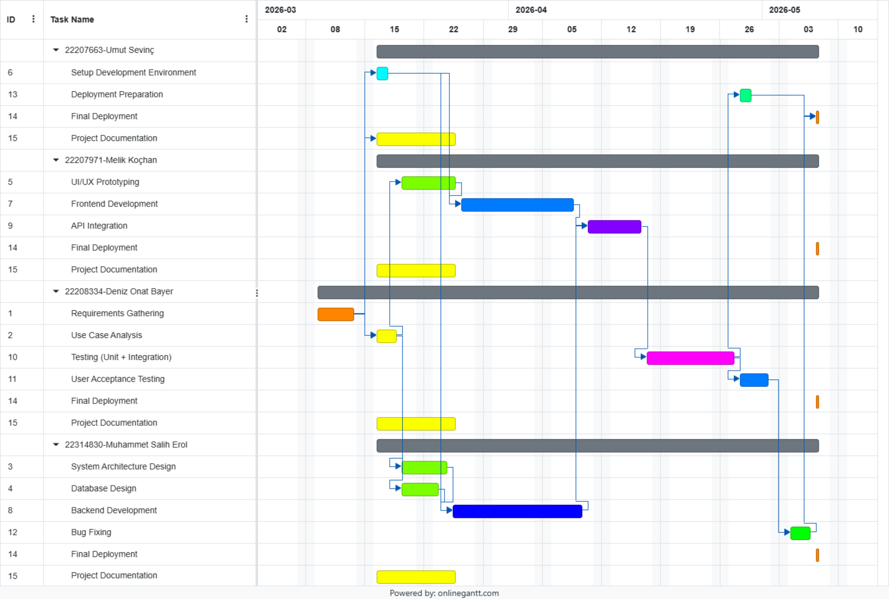
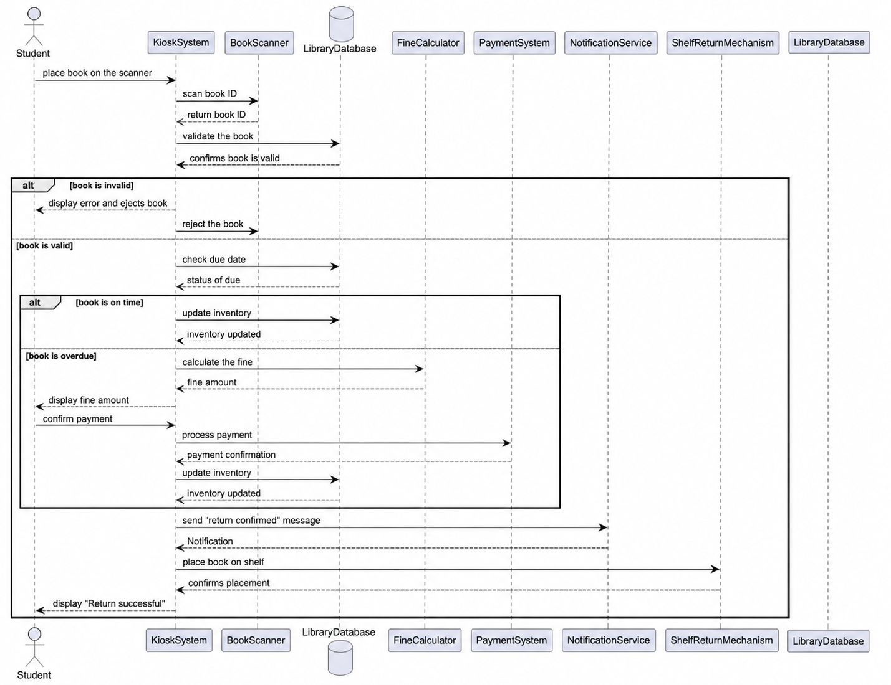
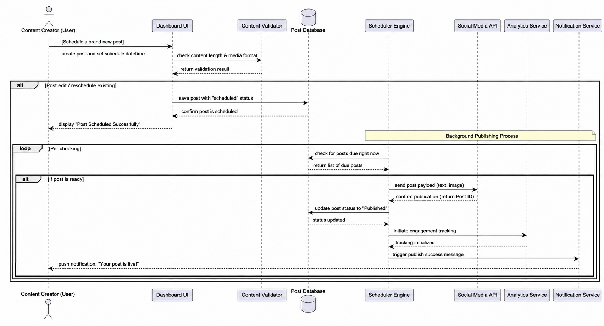

# CMPE314 - Lab 1 Gantt Chart

## Project Title
POSTLA Project

## Team Members
- Deniz Onat Bayer
- Umut Sevinç
- Muhammet Salih Erol
- Melik Koçhan

## Project Description
This project focuses on project planning and scheduling for a software engineering project. The Gantt chart demonstrates task durations, dependencies, milestones, and resource allocation among team members.

## Gantt Chart

# CMPE314 - Lab 4 Sequence Diagrams

## Part 1: Library Kiosk

### Description
In the normal flow, the student places the book on the scanner, and the system scans and validates it using the library database. If the book is valid and returned on time, the system updates the inventory, sends a confirmation notification, and places the book back on the shelf. 

In an alternative flow, if the book is overdue, the system calculates a fine and requires payment before completing the return.

## Part 2: POSTLA Project

### Description
In the normal flow, the content creator creates a post and schedules it using the dashboard. The system validates the content, saves it in the database with a scheduled status, and confirms the scheduling.

In an alternative flow, the scheduler engine periodically checks for posts that are ready to be published. When a post is due, it is sent to the social media API, and upon successful publishing, the system updates the post status, starts analytics tracking, and sends a notification to the user indicating that the post is live.
